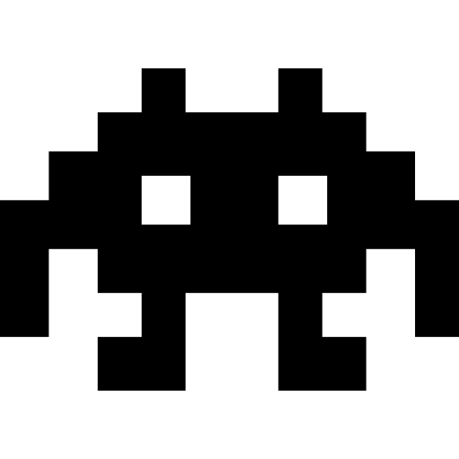

<div align="center">
  
  <h1><b>2DEditor</b></h1>
  <p>
    A Roblox Studio plugin created to assist in developing 2D games on Roblox
  </p>
</div>

<div align="center">
  <video src="https://github.com/user-attachments/assets/fba499aa-d1a4-480d-bccf-69882a3cdbde" width="800" controls></video>
</div>

## Getting Started

### Install the Plugin

1. Open the [2DEditor Plugin Page](https://create.roblox.com/store/asset/76283555630700/2DEditor)
2. Click **Get Plugin** to install it in Roblox Studio
3. Open Roblox Studio and find 2DEditor in your Plugins tab

### Development Setup

If you want to contribute or explore the source code:

1. **Clone the repository**
   ```bash
   git clone https://github.com/Denched/2DEditor.git
   cd 2DEditor
   ```

2. **Install Rokit** (tool manager)
   ```bash
   # If you have Aftman installed
   aftman install rokit
   rokit install

   # Or install Rokit directly from https://github.com/rojo-rbx/rokit
   ```

3. **Start the Rojo server**
   ```bash
   rojo serve
   ```

4. **Connect in Roblox Studio**
   - Open Roblox Studio
   - Install the Rojo plugin if you haven't
   - Click **Connect** in the Rojo plugin panel


## Credits

This project utilises the following open-source projects:

- [Vide](https://github.com/littensy/vide) — Reactive UI framework for Roblox
- [Rojo](https://github.com/rojo-rbx/rojo) — Project management and syncing
- [Rokit](https://github.com/rojo-rbx/rokit) — Package Manager
## Development Status

This project is under active development. Some areas may be refactored or improved over time. If you encounter issues or have suggestions, please open an issue.

